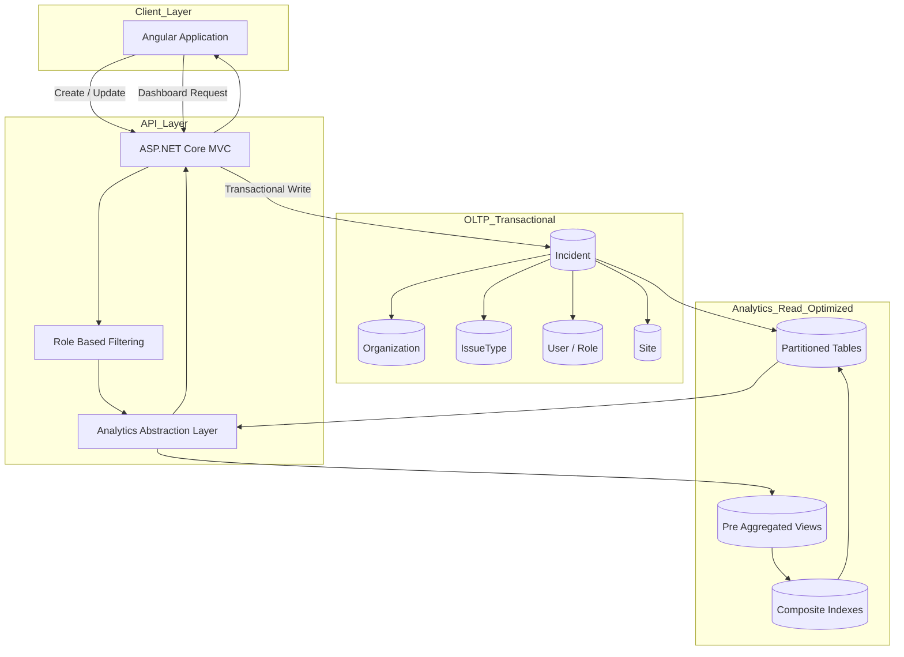

# Incident Management System  
### Multi-Tenant 기반 실시간 사고(사건) 보고 및 고급 분석 플랫폼

[English 🇺🇸](README.md)

---

## Executive Summary

AWS 기반으로 구축된 **멀티테넌트 SaaS Incident Management Platform**.

- 실시간 사건 등록 및 추적
- 계층형 IssueType 기반 분류
- Role 기반 접근 제어 (RBAC)
- 고집계(High Aggregation) 분석 대시보드
- 수천 개 기관 단위 확장 가능 구조

저는 전체 시스템 설계에 참여했으며,  
**End-to-End Analytics Dashboard를 단독 설계 및 구현**.

---

## 운영 규모 (Production Scale)

- 🏫 약 2,000개 학교 (LA 교육청 관할)
- 👥 수십만 명 사용자
- 🚨 일 평균 수백 건 이상의 Incident 발생
- 🏢 orgId 기반 멀티테넌트 SaaS 구조
- ⚡ 실시간 운영 트래픽 환경에서 고집계 분석 처리

---

# 상세 내용 (클릭하여 펼치기)

---

<details>
<summary><strong>🧩 시스템 개요</strong></summary>

### 시스템 목표

- 실시간 사건/사고 등록 (COVID, 총기, 독감, 위협 사례 등)
- 계층형 IssueType 기반 사고 분류
- Role 기반 접근 제어 (RBAC)
- 관계자 즉시 알림
- 상태 기반 라이프사이클 추적
- 다차원 분석 대시보드 제공

### Incident 처리 흐름

1. IssueType 계층 구조에 따라 분류
2. 조직 및 Role 기반 관리
3. 상태 변경을 통해 라이프사이클 추적
4. 분석용 집계 데이터에 반영

</details>

---

<details>
<summary><strong>🏗 아키텍처</strong></summary>

### Infrastructure
- AWS RDS (MySQL)
- orgId 기반 멀티테넌트 구조
- 클라우드 배포

### Backend
- ASP.NET Core MVC
- RESTful API 계층
- Role 기반 권한 제어
- Incident 라이프사이클 관리

### Frontend
- Angular
- Role 기반 UI 렌더링
- 인터랙티브 대시보드
- Map 기반 시각화

### Data Architecture
[Data Architecture 문서](data-engineering.md)

### 구조 다이어그램 (축약)




</details>

---

<details>
<summary><strong>📊 프로덕션 분석 대시보드 (단독 설계 및 구현)</strong></summary>

### 일부 예시 화면


### 데이터 흐름

```
MySQL (Analytics Views)
        ↓
ASP.NET Core REST API
        ↓
Angular Dashboard
        ↓
그래프 & 지도 기반 시각화
```

제가 수행한 역할:

- Analytics 데이터 아키텍처 설계
- DB 기반 집계 View 설계 및 구현
- REST Analytics API 구현
- Angular Dashboard 구현
- Drill-down / 필터링 로직 설계
- Map 기반 공간 분석 통합
- 지속적 성능 튜닝 및 개선

</details>

---

<details>
<summary><strong>⚙ 성능 최적화 전략</strong></summary>

### 1️⃣ 인덱스 전략

- 자주 필터링되는 복수 컬럼 기반 Composite Index 설계
- `createdAt DESC` 인덱스 적용
- 실행 계획 안정화를 위한 커버링 인덱스 설계
- Full Table Scan 최소화

---

### 2️⃣ 파티셔닝 전략

- LIST Partition (카테고리 기반)
- RANGE Partition (시간 기반)
- Partition Pruning 활용

---

### 3️⃣ 클라이언트 병렬 처리

`await Promise.all()` 기반 병렬 API 호출

→ 독립 데이터 동시 로딩  
→ 체감 응답 속도 개선

</details>

---

<details>
<summary><strong>📈 View 기반 사전 집계 전략</strong></summary>

### View Pre-Aggregation을 선택한 이유

- 여러 대시보드에서 재사용 가능
- 반복 집계 쿼리 안정화
- API 계산 부담 감소
- View 내부 Optimizer 튜닝
- Lazy Loading 성능 저하 방지

### 설계 원칙

- GROUP BY 기반 사전 집계
- 날짜 인덱스 활용
- orgId 기반 데이터 분리
- 실행 계획 예측 가능성 확보

</details>

---

<details>
<summary><strong>📊 주요 분석 기능</strong></summary>

- Issue Type별 사고 분석
- Location별 분포 분석
- Reporter 기반 패턴 분석
- Risk / Threat 수준 분석
- 월별 / 분기별 시계열 분석
- Map 기반 클러스터링 및 Top Site 분석

</details>

---

<details>
<summary><strong>🔐 Role 기반 분석 통제</strong></summary>

Analytics 계층에서 보장하는 요소:

- 조직 단위 데이터 격리
- Role 기반 접근 통제
- 민감 사고 유형 필터링
- 신고자 가시성 제한

※ 데이터 필터링은 UI가 아닌 쿼리 레벨에서 적용

</details>

---

<details>
<summary><strong>👨‍💻 나의 기여</strong></summary>

### 시스템 레벨 참여

- 도메인 모델 설계
- Incident / IssueType 스키마 설계 참여
- 테이블 및 인덱스 설계
- 성능 분석 및 튜닝

### 1인 담당 (Analytics Layer)

- Analytics 데이터 아키텍처 설계
- 집계 View 설계 및 구현
- REST API 구현
- Angular Dashboard 개발
- Drill-down / 필터링 설계
- 공간 분석 통합
- Analytics 계층 유지보수

</details>

---

<details>
<summary><strong>📊 정량적 성과</strong></summary>

- Analytics 계층을 처음부터 설계 및 구축
- 대시보드 응답 지연 시간 **20% 감소**
- 집계 성능 **20% 개선**
- 대규모 집계 워크로드 안정화
- 수천 기관 단위 실시간 인사이트 제공

</details>

---

## 기술적 특징

- 멀티테넌트 SaaS 구조
- 계층형 IssueType 모델
- Partition-aware 집계 최적화
- Composite Index 전략
- View 기반 Optimizer 튜닝
- 공간 기반 데이터 분석
- End-to-End Analytics 단독 소유

---

## 🏁 프로젝트 효과

본 시스템은:

- 긴급 사건/사고의 신속한 보고
- 실시간 위험 분포 모니터링
- 처리 워크플로우 추적
- 과거 트렌드 분석
- 데이터 기반 의사결정 지원

Analytics Dashboard는 대규모 운영 데이터를  
**의사결정 가능한 인사이트로 전환하는 핵심 계층**.
