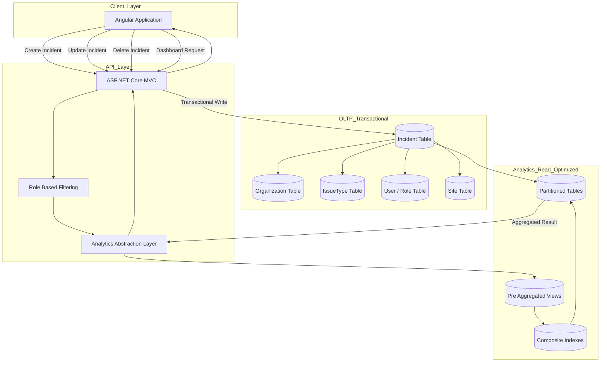

# Incident Management System  
### Multi-Tenant 기반 실시간 사고(사건) 보고 및 고급 분석 플랫폼

[English 🇺🇸](README.md)

본 프로젝트는 다음 기술 스택을 기반으로 구축된 클라우드 기반 Incident Management System.

- AWS RDS (MySQL)
- ASP.NET Core MVC
- Angular
- AWS Infrastructure

본 플랫폼은 조직 단위로 사건/사고를 실시간으로 보고·분류·추적·분석할 수 있도록 설계.

기여도: 전체 시스템 아키텍처 설계 및 구현에 참여,  
**End-to-End Analytics Dashboard 설계 및 구현을 담당.**

---

# 시스템 규모 (Production Scale)

해당 시스템은 실제 운영 환경에서 다음 규모로 동작:

- 🏫 약 2,000개 학교 (LA 교육청 관할 학교들)
- 👥 수십만 명 사용자
- 🚨 일 평균 수백 건 이상의 Incident 발생
- 🏢 멀티테넌트 SaaS 구조

Analytics 계층은 실시간 트래픽 환경에서 고집계(High Aggregation) 워크로드를 처리하도록 설계되었습니다.

---

## 시스템 개요

본 시스템의 목표:

- 실시간 사건/사고 등록 (예: COVID, 총기 사건, 독감, 위협 사례 등)
- 계층형 IssueType 기반 사고 분류
- Role 기반 접근 제어 (RBAC)
- 사고 발생 시 관계자 즉시 알림
- 사고 처리 상태 및 이력 추적
- 다차원 분석 대시보드 제공

각 Incident는 다음 흐름을 따른다:

1. IssueType 계층 구조에 따라 분류
2. 조직 및 역할(Role)에 따라 관리
3. 상태 변경을 통해 라이프사이클 추적
4. 분석용 집계 데이터에 반영

---

## 아키텍처

### Infrastructure
- AWS RDS (MySQL)
- orgId 기반 멀티테넌트 구조
- 클라우드 배포 환경

### Backend
- ASP.NET Core MVC
- RESTful API 계층
- Role 기반 권한 제어
- Incident 라이프사이클 관리

### Frontend
- Angular
- Role 기반 UI 제어
- 인터랙티브 대시보드
- 지도(Map) 기반 시각화

### [Data Architecture](data-engineering.md)

### Diagram - 축약 버전




---

# 프로덕션 분석 대시보드 (단독 담당)

Analytics 계층 전체를 단독 설계 및 구현 - 일부 예제


### 데이터 흐름

```
MySQL (Analytics Views)
        ↓
ASP.NET Core REST API
        ↓
Angular Dashboard
        ↓
인터랙티브 그래프 & 지도 시각화
```

---

# 성능 최적화 전략

## 1️⃣ 인덱스 전략

- 자주 필터링되는 복수 컬럼 기반 Composite Index 설계
- UI에서 최신 데이터 우선 노출을 위해 `createdAt DESC` 인덱스 적용
- 실행 계획 안정화를 위한 인덱스 커버리지 개선
- 대량 트래픽 환경에서 Full Table Scan 최소화

---

## 2️⃣ 파티셔닝 전략

테이블 특성에 맞춘 파티셔닝 적용:

- LIST Partition: 카테고리 기반 분리
- RANGE Partition: 시간 기반 분리
- Partition Pruning을 통한 Analytics 쿼리 최적화

---

## 3️⃣ 클라이언트 병렬 처리

UI 응답 속도 개선을 위해 독립 API를 병렬 호출: ```await Promise.all```

독립 데이터 병렬 로딩으로 체감 성능 개선.

---

# View 기반 사전 집계 전략

모든 분석은 최적화된 MySQL View를 기반으로 구성.

## View Pre-Aggregation을 선택한 이유

- 여러 대시보드에서 재사용 가능
- Analytics 특성상 반복 집계 쿼리 안정화
- API 레벨 계산 부담 감소
- View 내부에서 Optimizer 튜닝 (Index 전략 및 실행 계획 안정화)
- Lazy Loading으로 인한 성능 저하 방지

설계 원칙:

- GROUP BY 기반 사전 집계
- 날짜 인덱스 활용
- orgId 기반 데이터 분리
- 실행 계획 예측 가능성 확보

---

# 주요 분석 기능

### Issue Type별 사고 분석
시간 기반 + 카테고리 기반 집계 및 추세 비교

### Location별 사고 분석
Site 단위 분포 및 비교 분석

### Reporter 기반 분석
신고 패턴 분석 및 Role 기반 필터 적용

### Risk / Threat 수준 분석
위험도 분포 및 상승 추세 모니터링

### 시계열 추세 분석
월별 / 분기별 집계 및 상태 기반 분석

### 공간 분석 (Map 기반)
사고 클러스터링 및 Top 10 Site 분석

---

# Role 기반 분석 통제

Analytics 계층은 다음을 보장합니다:

- 조직 단위 데이터 격리
- Role 기반 접근 통제
- 민감 사고 유형 필터링
- 신고자 가시성 제한

데이터 필터링은 UI가 아닌 쿼리 레벨에서 적용.

---

# 나의 기여

### 시스템 레벨 참여
- 전체 스키마 모델 설계 참여
- 전체 tables / indexes 구성
- 성능 분석 및 튜닝

### 1인 담당 (Analytics Layer)
- Analytics 데이터 아키텍처 설계
- DB 기반 집계 View 설계 및 구현
- REST Analytics API 구현
- Angular Dashboard 구현
- Drill-down 및 필터링 로직 구현
- Map 기반 공간 분석 통합
- Analytics 계층 유지보수 및 확장

---

# 정량적 성과

- Analytics 계층을 처음부터 설계 및 구축
- 대시보드 응답 지연 시간 **20% 감소**
- 집계 성능 **20% 개선**
- 대규모 집계 워크로드 안정화
- 수천 개 기관 단위 실시간 인사이트 제공

---

# 기술적 특징

- 멀티테넌트 SaaS 아키텍처
- 계층형 IssueType 모델
- Partition-aware 집계 최적화
- Composite Index 전략
- View 기반 Optimizer 튜닝
- 공간 기반 데이터 분석
- End-to-End Analytics 파이프라인 단독 소유

---

# 프로젝트 효과

본 시스템의 역할:

- 긴급 사건/사고의 신속한 보고
- 실시간 위험 분포 모니터링
- 처리 워크플로우 추적
- 과거 사건/사고 트렌드 분석
- 데이터 기반 의사결정 지원

Analytics Dashboard는 대규모 운영 데이터를  
**의사결정 가능한 인사이트로 전환합니다.**
