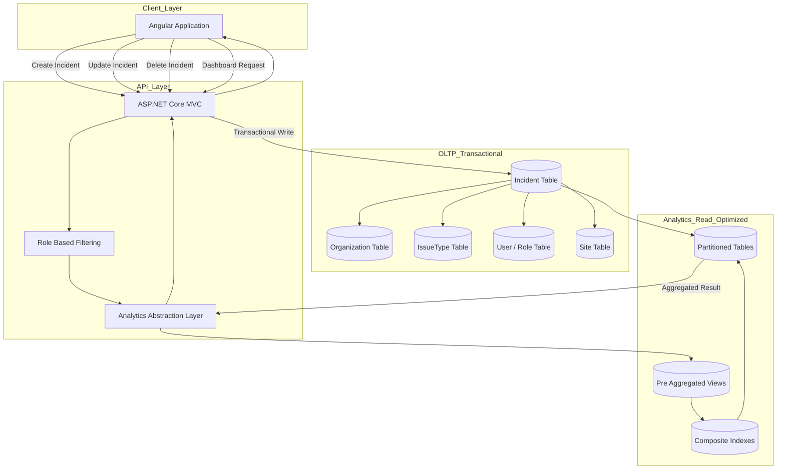

# Incident Management System
### Multi-Tenant Real-Time Reporting & Advanced Analytics Platform

[한국어 🇰🇷](README.Ko.md)

This project is a cloud-based Incident Management System built using:

- AWS RDS (MySQL)
- ASP.NET Core MVC
- Angular
- AWS Infrastructure

The platform enables real-time incident reporting, classification, tracking, and analytics across organizations.

I participated in the overall system architecture design and independently designed and implemented the **End-to-End Analytics Dashboard**.

---

# System Scale

The system operates at production scale:

- 🏫 ~2,000 schools (LAUSD jurisdiction)
- 👥 Hundreds of thousands of users
- 🚨 Hundreds of incidents generated daily
- 🏢 Multi-tenant SaaS architecture

The analytics layer is designed to handle high aggregation workloads under real-time operational traffic.

---

## System Overview

The system is designed to:

- Capture incidents in real time (e.g., COVID, shooting, flu, threat cases)
- Classify incidents using hierarchical Issue Types
- Enforce role-based access control (RBAC)
- Notify relevant stakeholders immediately
- Track incident lifecycle and resolution status
- Provide multi-dimensional analytics dashboards

Each incident is:

1. Reported and classified (IssueType hierarchy)
2. Managed based on Role and Organization
3. Tracked through status changes
4. Included in aggregated analytics views

---

## Architecture

### Infrastructure
- AWS RDS (MySQL)
- Multi-tenant architecture (orgId-based separation)
- Cloud deployment

### Backend
- ASP.NET Core MVC
- RESTful API layer
- Role-based authorization
- Incident lifecycle management

### Frontend
- Angular
- Role-aware UI rendering
- Interactive dashboards
- Map-based visualization

### [Data Architecture](data-engineering.md)

### Diagram - Short Version




---

# Production Analytics Dashboard (My Ownership)

I independently designed and implemented the entire analytics layer.

### Data Flow

```
MySQL (Analytics Views)
        ↓
ASP.NET Core REST API
        ↓
Angular Dashboard
        ↓
Interactive Graph & Map Visualization
```

---

# 🛠 Performance Optimization Strategy

## 1️⃣ Index Strategy

- Composite indexes using multiple frequently filtered columns
- Descending index on `createdAt` for latest-first UI rendering
- Query plan stabilization via proper index coverage
- Reduced full table scans under heavy traffic

---

## 2️⃣ Partitioning Strategy

Applied table-specific partitioning:

- LIST partitioning for categorical segmentation
- RANGE partitioning for time-series data
- Optimized partition pruning for analytics queries

---

## 3️⃣ Client-Side Parallelization

Reduced UI wait time via parallel API calls: ```Promiss.ALL()```

Enabled concurrent fetching of independent datasets, improving perceived responsiveness.

---

# 📊 View-Based Pre-Aggregation Strategy - part of examples


Analytics is powered by optimized MySQL Views.

## Why View Pre-Aggregation?

- Reusability across multiple dashboards
- Heavy aggregation workloads stabilized at DB level
- Reduced repeated computation at API layer
- Optimizer-level tuning inside views (index strategy & execution plan stabilization)
- Avoidance of lazy-loading performance pitfalls

Design principles:

- GROUP BY pre-aggregation
- Indexed date filtering
- orgId partition isolation
- Execution plan predictability

---

# Analytics Capabilities

### Case Per Issue Type
Time-based + category-based aggregation with trend comparison.

### Case Per Location
Site-level distribution and comparative analysis.

### Reporter-Based Analysis
Behavioral pattern visibility with role-aware filtering.

### Risk / Threat Segmentation
Severity distribution and escalation trend monitoring.

### Time-Series Trend Analysis
Monthly / quarterly aggregation and lifecycle metrics.

### Spatial Intelligence
Map-based clustering and top affected site ranking.

---

# Role-Based Analytics Enforcement

Analytics layer enforces:

- Organization isolation
- Role-based access control
- Sensitive data filtering
- Reporter visibility constraints

Filtering occurs at query layer, not just UI.

---

# My Contribution

### System-Level Participation
- Contributed to domain modeling
- Participated in Incident / IssueType schema design
- Collaborated on RBAC structure

### Sole Ownership (Analytics Layer)
- Designed analytics data architecture from scratch
- Built DB-level analytic views
- Implemented REST analytics endpoints
- Developed Angular analytics dashboard
- Implemented filtering and drill-down logic
- Integrated map-based spatial visualization
- Maintain and evolve the analytics layer

---

# Measurable Impact

- Analytics layer designed from scratch
- Reduced dashboard latency by **20%**
- Improved aggregation performance by **10%**
- Stabilized heavy aggregation workloads at production scale
- Enabled real-time insight visibility across thousands of schools

---

# 📈 Engineering Highlights

- Multi-tenant SaaS architecture
- Hierarchical IssueType modeling
- Partition-aware analytics optimization
- Composite index strategy
- View-level optimizer tuning
- Spatial data analytics
- Full-stack analytics pipeline ownership

---

# Project Impact

The system enables organizations to:

- Rapidly report critical incidents
- Monitor risk distribution in real time
- Track resolution workflows
- Analyze historical trends
- Improve operational response efficiency

The analytics dashboard transforms large-scale operational data into actionable intelligence.
