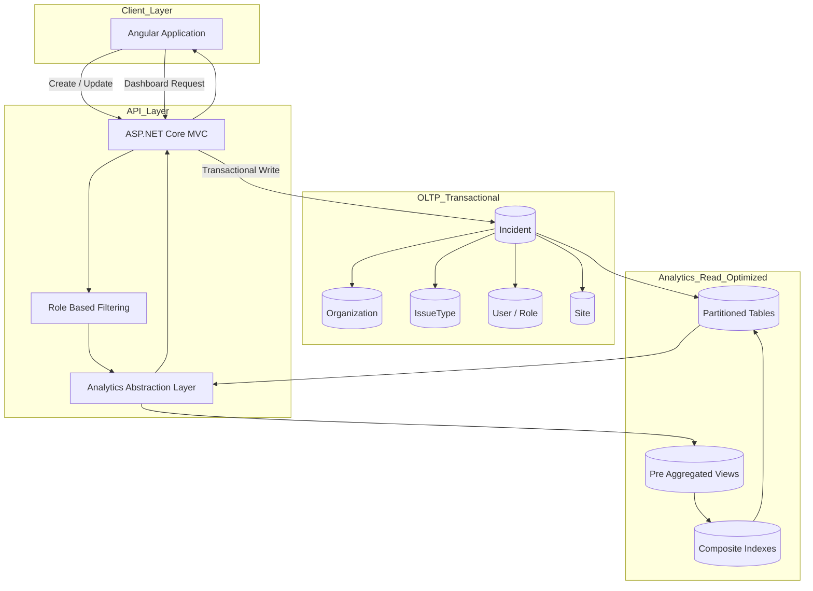

# Incident Management System
### Multi-Tenant Real-Time Reporting & Advanced Analytics Platform

[한국어 🇰🇷](README.Ko.md)

---

## Executive Summary

Cloud-based Incident Management System built with:

- AWS RDS (MySQL)
- ASP.NET Core MVC
- Angular
- AWS Infrastructure

Supports:

- Real-time incident reporting
- Multi-tenant SaaS architecture
- Hierarchical issue classification
- Role-based access control
- Advanced analytics dashboard

I participated in overall architecture design and independently owned the **End-to-End Analytics Dashboard**.

---

## Production Scale

- 🏫 ~2,000 schools (LAUSD jurisdiction)
- 👥 Hundreds of thousands of users
- 🚨 Hundreds of incidents generated daily
- 🏢 Multi-tenant SaaS architecture
- ⚡ Real-time operational analytics

---

# Detailed Sections (Click to Expand)

---

<details>
<summary><strong>🧩 System Overview</strong></summary>

The system is designed to:

- Capture incidents in real time (COVID, shooting, flu, threat cases)
- Classify incidents using hierarchical Issue Types
- Enforce role-based access control (RBAC)
- Notify stakeholders immediately
- Track incident lifecycle and resolution
- Provide multi-dimensional analytics dashboards

Incident lifecycle:

1. Reported and classified (IssueType hierarchy)
2. Managed based on Role and Organization
3. Tracked through status changes
4. Aggregated into analytics views

</details>

---

<details>
<summary><strong>🏗 Architecture</strong></summary>

### Infrastructure
- AWS RDS (MySQL)
- Multi-tenant architecture (orgId-based isolation)
- Cloud deployment

### Backend
- ASP.NET Core MVC
- RESTful API layer
- Role-based authorization
- Incident lifecycle management

### Frontend
- Angular
- Role-aware UI rendering
- Interactive dashboards
- Map-based visualization

### Data Architecture
[Data Architecture Documentation](data-engineering.md)

### Diagram (Short Version)




</details>

---

<details>
<summary><strong>📈 Production Analytics Dashboard (My Ownership)</strong></summary>

### Data Flow

```
MySQL (Analytics Views)
        ↓
ASP.NET Core REST API
        ↓
Angular Dashboard
        ↓
Interactive Graph & Map Visualization
```

I independently:

- Designed analytics schema
- Built DB-level analytic views
- Implemented REST endpoints
- Developed Angular dashboard
- Implemented drill-down & filtering
- Integrated spatial visualization
- Maintain and evolve analytics layer

</details>

---

<details>
<summary><strong>⚙ Performance Optimization Strategy</strong></summary>

### 1️⃣ Index Strategy

- Composite multi-column indexes
- Descending index on `createdAt`
- Query plan stabilization
- Reduced full table scans

---

### 2️⃣ Partitioning Strategy

- LIST partitioning (categorical)
- RANGE partitioning (time-series)
- Partition pruning optimization

---

### 3️⃣ Client-Side Parallelization

Used `Promise.all()` to parallelize API calls.

Result:
- Reduced dashboard wait time
- Improved perceived performance

</details>

---

<details>
<summary><strong>📊 View-Based Pre-Aggregation Strategy</strong></summary>


Analytics powered by optimized MySQL Views.

### Why View Pre-Aggregation?

- Reusable across dashboards
- Stabilized heavy aggregation at DB level
- Reduced repeated API computation
- Optimizer-level tuning
- Avoided lazy-loading pitfalls

Design principles:

- GROUP BY pre-aggregation
- Indexed date filtering
- orgId partition isolation
- Execution plan predictability

</details>

---

<details>
<summary><strong>📊 Analytics Capabilities</strong></summary>

- Case per Issue Type
- Case per Location
- Reporter-based behavioral analysis
- Risk / Threat segmentation
- Time-series trend analysis
- Spatial clustering & site ranking

</details>

---

<details>
<summary><strong>🔐 Role-Based Analytics Enforcement</strong></summary>

Analytics layer enforces:

- Organization isolation
- Role-based access control
- Sensitive data filtering
- Reporter visibility constraints

Filtering occurs at query layer, not only UI.

</details>

---

<details>
<summary><strong>👨‍💻 My Contribution</strong></summary>

### System-Level Participation

- Domain modeling
- Incident / IssueType schema design
- RBAC collaboration

### Sole Ownership (Analytics Layer)

- Designed analytics architecture
- Built optimized DB views
- Implemented REST endpoints
- Developed Angular dashboard
- Implemented drill-down logic
- Integrated spatial visualization
- Continuous performance tuning

</details>

---

<details>
<summary><strong>📈 Measurable Impact</strong></summary>

- Built analytics layer from scratch
- Reduced dashboard latency by **20%**
- Improved aggregation performance by **10%**
- Stabilized heavy workloads in production
- Enabled real-time insights across thousands of schools

</details>

---

## Engineering Highlights

- Multi-tenant SaaS architecture
- Hierarchical IssueType modeling
- Partition-aware analytics optimization
- Composite index strategy
- View-level optimizer tuning
- Spatial data analytics
- Full-stack analytics pipeline ownership

---

## 🏁 Project Impact

The system enables organizations to:

- Rapidly report critical incidents
- Monitor risk distribution in real time
- Track resolution workflows
- Analyze historical trends
- Improve operational response efficiency

The analytics dashboard transforms large-scale operational data into actionable intelligence.
